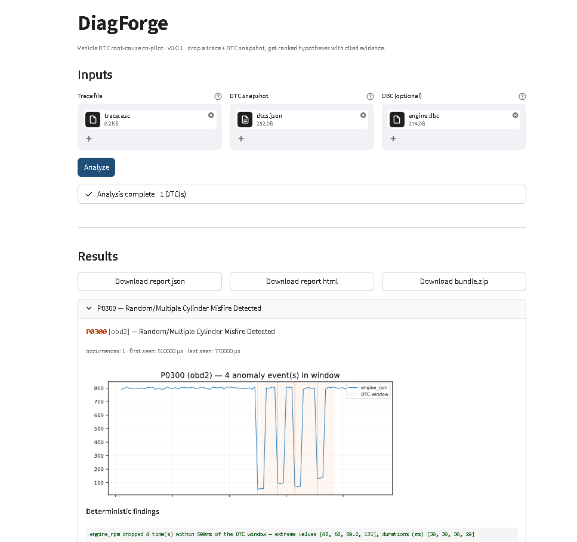

# DiagForge

> **An open-source root-cause co-pilot for vehicle diagnostic trouble codes.**

[](https://opensource.org/licenses/MIT)
[](https://www.python.org/downloads/)
[](#roadmap)
[](#standards-referenced)



*DiagForge's web UI analyzing a P0300 intermittent misfire trace.*

---

## What it does

DiagForge takes a captured vehicle diagnostic trace (CAN, CAN-FD, UDS, or
OBD-II logs) and a list of observed DTCs, and turns the question *"why did
this fault set, and what should I change to stop it?"* into a structured
evidence report you can read in 30 seconds.

It does not replace your scan tool, your service manual, or your test bench.
What it removes is the first hour of mechanical pattern-matching that every
intermittent-fault investigation starts with — sifting through CAN frames,
correlating signal transitions, and cross-checking against the dozen or so
recurring fault-handling mistakes that account for most production false
positives.

Two layers do the work. A **deterministic signal analyzer** computes timing
statistics, value anomalies, and communication gaps around each DTC's
occurrence window — every finding it produces is a real measurement from the
trace, not an inference. A **diagnostic agent** then asks the Anthropic
Claude API (Claude Opus 4.7 by default) to rank candidate root causes and
match them against a curated library of mitigation patterns. The model is
constrained by Anthropic's `tool_use` schema, and every hypothesis it
returns must cite an analyzer-produced finding verbatim — it cannot
fabricate numbers, signal names, or ISO clause references.

The output is an evidence bundle: a structured JSON report (for tooling
integration), a self-contained HTML report with inline timing diagrams (for
review and sharing), and a sha256-anchored manifest (for archival).

## The problem

Field-service engineers, ECU developers, and integration testers spend a
disproportionate share of their time on DTC analysis. The work is largely
manual: open the trace, locate the DTC's timestamp, scroll back a few
hundred milliseconds, identify the signals that look anomalous, formulate a
hypothesis, dig through service procedures to confirm, and finally propose
a fix. Each step is tractable; the bottleneck is the total number of cases
multiplied by the volume of trace data per case.

The tooling that automates any of this is largely OEM-proprietary, expensive,
or both. Open-source automotive diagnostic analysis is thin. AI-assisted
variants barely exist in the public toolchain.

Most false-positive faults in production ECU software fall into a small set
of recurring patterns: insufficient debounce on discrete inputs, missing
dematuration timers on analog signals oscillating near a threshold, NVM
update races across power cycles, plausibility gaps between redundant
signals, and unbounded gradient acceptance on physical readings. DiagForge
codifies these patterns, matches them against observed trace data
automatically, and emits concrete parameter suggestions derived from the
analyzer's findings — not generic boilerplate.

## Features

- **Multi-format ingestion** — ASC (Vector ASCII CAN logs), `.log`
  (canutils / candump format with UDS service-level decoding), and JSON DTC
  snapshots. Optional DBC for named signal decoding; an auto-decoder runs
  when no DBC is provided.
- **Deterministic signal analysis** — median + median-absolute-deviation
  value-anomaly baseline (robust to non-Gaussian ECU signals), transition
  detection with an analog-skip heuristic, and a publish-gap detector for
  lost-communication patterns. Every finding carries the numbers it was
  derived from.
- **LLM-driven diagnostic agent** — strict structured output via Anthropic
  `tool_use` against the Claude Opus 4.7 model (with Claude Sonnet 4.6 as a
  fallback). Every hypothesis must cite a verbatim analyzer finding;
  uncited evidence triggers a single feedback-retry, then a typed
  `EvidenceMissingError`.
- **Curated mitigation pattern library** — 10 patterns covering debounce,
  dematuration, retry state machines, plausibility checks, communication
  retry with backoff, oscillation hysteresis, signal freshness, gradient
  limits, cross-ECU consensus, and boundary-condition guards. Four of the
  ten compute concrete numeric parameter suggestions from the analyzer's
  observations.
- **Multi-DTC correlation** — co-occurrence detection (DTCs that set
  within the same 100 ms window) and causal ordering (DTC A consistently
  precedes DTC B across multiple events). Surfaces in a dedicated
  `cross_dtc_findings` block of the report.
- **Three production-realistic demo cases** — `P0300` random misfire
  (engine-RPM dropout cluster), `U0100` lost communication with ECM/PCM
  (per-source bus silence windows), and `P0420` catalyst threshold
  (oscillating post-cat O2 sensor).
- **Streamlit web UI** — drag-and-drop file upload, live progress, per-DTC
  cards with embedded inline-SVG timing diagrams, and one-click downloads
  for the JSON, HTML, and full audit bundle.
- **CLI for headless and scripted use** — `diagforge analyze` with options
  for the model, the analysis window, DBC, and verbose logging.
- **GitHub Action for PR-triggered analysis** — automatically runs
  DiagForge on any trace + DTC pair added or modified by a pull request,
  posts a Markdown summary as a PR comment, and uploads the full reports
  as a workflow artefact.
- **Evidence reports** — structured JSON conforming to a versioned schema,
  human-readable HTML with inline CSS (no JavaScript, no external assets,
  no fonts), and a sha256-hashed manifest.

## Quick start

### Install

```bash
git clone https://github.com/satyanar-lab/DiagForge.git
cd DiagForge
make install                          # poetry install + dep check
export ANTHROPIC_API_KEY=sk-...       # required; read at run time, never committed
```

### CLI

```bash
poetry run diagforge analyze \
  examples/p0300_intermittent_misfire/trace.asc \
  --dtcs examples/p0300_intermittent_misfire/dtcs.json \
  --dbc  examples/p0300_intermittent_misfire/engine.dbc \
  --output ./demo-output/

open demo-output/report.html          # macOS;  xdg-open on Linux
```

Three demo cases ship with the tool. Run any of them with the bundled
Makefile targets:

```bash
make demo                             # P0300 intermittent misfire
make demo-u0100                       # U0100 lost communication with ECM/PCM
make demo-p0420                       # P0420 catalyst threshold
make demo-all                         # all three back-to-back
```

Each run writes `report.json`, `report.html`, and `manifest.json` to
`./demo-output/<slug>/`.

### Web UI

```bash
make ui                               # launches Streamlit on localhost:8501
```

Drag a trace file, a DTC snapshot JSON, and (optionally) a DBC into the
three uploaders, hit **Analyze**, and the per-DTC results render in-page
with timing diagrams. The same three artefacts are available as one-click
downloads.

## Architecture

```
[ CAN/CAN-FD/UDS log + DTC snapshot + (optional) DBC ]
                       │
                       ▼
   ┌──────────────────────────────┐
   │  1. Trace Ingestion          │   python-can, cantools, udsoncan
   └──────────────────────────────┘
                       │  normalized events
                       ▼
   ┌──────────────────────────────┐
   │  2. Pattern Analyzer         │   timing stats, value anomalies,
   │     (deterministic)          │   communication gaps, multi-DTC
   └──────────────────────────────┘
                       │  pattern features
                       ▼
   ┌──────────────────────────────┐
   │  3. Diagnostic Agent (LLM)   │   ranked hypotheses + cited evidence
   │     (Claude Opus 4.7)        │   strict tool_use structured output
   └──────────────────────────────┘
                       │  hypotheses
                       ▼
   ┌──────────────────────────────┐
   │  4. Mitigation Recommender   │   pattern matching + computed
   │                              │   parameter suggestions
   └──────────────────────────────┘
                       │  patterns + verification approach
                       ▼
   ┌──────────────────────────────┐
   │  5. Evidence Report Emitter  │   JSON + HTML + sha256 manifest
   └──────────────────────────────┘
                       │
                       ▼
                [ audit-bundle/ ]
```

Layers 1, 2, 4, and 5 are 100 % deterministic — the same trace and the
same DTC snapshot always produce the same numeric findings, the same
matched patterns, and the same report bundle. Layer 3 is the only
non-deterministic step; it operates exclusively on the structured output
of Layer 2 and is constrained to cite Layer 2's findings verbatim. The
report records the exact model alias the API served the request with and a
SHA-256 of the prompt sent to the model so any analysis can be retraced
later.

## Mitigation pattern library

| Pattern | Applies when |
|---|---|
| Duration-qualified debounce | A discrete input toggles within its own noise window before fault confirmation |
| Dematuration / fault-clear timer | An analog signal oscillates across a threshold, causing set/clear chatter |
| Communication retry with timeout backoff | Lost-communication DTC fires from brief per-source bus silence (U-code family) |
| Oscillation hysteresis | A signal chatters across a single threshold and a dematuration timer alone is insufficient |
| Signal freshness / timeout check | Stale received signal is consumed by safety logic without an age check |
| Gradient / rate-of-change limit | Physically-impossible single-sample jumps reach the fault evaluator |
| Cross-ECU consensus / voting | Redundant publishers disagree and a single source is trusted |
| Retry state machine with NVM persistence | Data loss across power cycles or transient NVM errors |
| Plausibility check across redundant signals | Sensor-vs-switch or sensor-vs-sensor mismatch with no cross-check |
| Boundary-condition guard | Off-by-one or array-out-of-bounds symptoms in fault data |

Each pattern is a YAML entry with: applicability conditions, parameter
schema with derivation rules, verification steps, and citations to public
ISO/SAE clauses. The runtime copy lives in `diagforge/mitigation/data/`
and is licensed **CC-BY-4.0** — adapt it for your own project, fork it,
and contribute additions back.

For four of the ten patterns the recommender derives concrete numeric
suggestions directly from the analyzer's observations rather than emitting
generic rationale text — for example, the misfire dematuration timer is
proposed as 5× the dominant inter-spike period rounded to the nearest 50 ms,
shown alongside the worked arithmetic so the engineer can reproduce the math.

## Standards referenced

- **ISO 14229-1** — Unified Diagnostic Services (UDS)
- **ISO 15031-5** — OBD-II emissions-related diagnostic services
- **ISO 15765** — Diagnostic communication over CAN
- **SAE J1939-73** — Heavy-duty vehicle diagnostics
- **ISO 11898** — CAN frame format
- **ISO 26262** — Functional safety (defensive measures, freshness,
  dependent failures)

DiagForge is a developer tool. It does **not** replace certified workshop
diagnostic equipment or OEM scan tools, and it does **not** certify any
output it produces — the report is developer evidence to support a
discussion, not a workshop verdict.

## Roadmap

**v0.2.0 (shipped)** — ASC and UDS `.log` ingestion, the deterministic
analyzer with value / transition / gap detection, the diagnostic agent with
strict tool-use structured output, 10 mitigation patterns with computed
parameters for four of them, multi-DTC correlation, the three demo cases,
Streamlit web UI, CLI, GitHub Action, and the evidence-report emitter.

**Future work**

- BLF (Vector Binary Logging) ingestion and J1939 service-level decoding
- Multi-channel CAN trace handling (multiple buses in a single log)
- Value computers for the remaining mitigation patterns (oscillation
  hysteresis band, signal freshness cycle hints, gradient physics
  metadata, cross-ECU redundancy detection)
- Per-occurrence DTC timestamps to strengthen the multi-DTC causal-ordering
  heuristic
- HTML timing diagrams with cross-signal correlation overlays
- Confidence calibration (compare model `confidence` against empirical
  accuracy across a labelled benchmark set)
- ML-based anomaly detection (isolation-forest baseline on signal feature
  spaces)
- Active-query mode where the agent asks for additional data when uncertain
- RAG over public standards summaries for richer citation grounding

## Project layout

```
DiagForge/
├── README.md                         (this file)
├── LICENSE                           MIT
├── Makefile                          install / lint / test / demo* / ui / build
├── pyproject.toml                    Poetry project + tool config
├── diagforge/                        source code
│   ├── ingestion/                    ASC, UDS .log, DTC JSON, signal decoding
│   ├── analyzer/                     timing, value, gap, multi-DTC
│   ├── diagnostic/                   LLM agent + tool_use schema
│   ├── mitigation/
│   │   └── data/                     YAML pattern library (CC-BY-4.0)
│   ├── report/                       JSON + HTML + chart emission
│   ├── ui/                           Streamlit web app
│   └── cli.py                        Click entry point
├── examples/                         three runnable demo cases
│   ├── p0300_intermittent_misfire/
│   ├── u0100_lost_comm/
│   └── p0420_catalyst_threshold/
├── tests/                            unit + integration
└── docs/                             screenshots and external-facing docs
```

The repository also carries a small set of internal design records and
project-history documents that aren't part of the user-facing surface; they
live alongside the code but are not required reading to use or extend the
tool.

## Contributing

Pull requests are welcome. Before opening one, please run:

```bash
make lint                             # ruff + ruff format check + mypy --strict
make test                             # pytest with coverage
```

Both must be green. The test suite uses a mocked diagnostic agent, so it
runs offline.

**Mitigation pattern contributions are especially welcomed.** New patterns
are YAML entries in `diagforge/mitigation/data/`; the schema is documented
inline in the existing pattern files. A good pattern submission includes
the applicability conditions, the parameter derivation rules, the
verification steps, and at least one publicly verifiable ISO or SAE
citation.

Bug reports and trace-shape requests are also welcome via GitHub Issues.
If you can include a short anonymised trace that reproduces the issue,
that helps enormously.

## License

- **Source code** — [MIT](LICENSE)
- **Mitigation pattern library** (`diagforge/mitigation/data/*.yaml`) —
  [CC-BY-4.0](https://creativecommons.org/licenses/by/4.0/)

The split license lets the pattern library be reused freely in other
diagnostic tools (commercial or open-source) provided the attribution is
preserved; the source code itself stays under MIT for maximum reuse.
